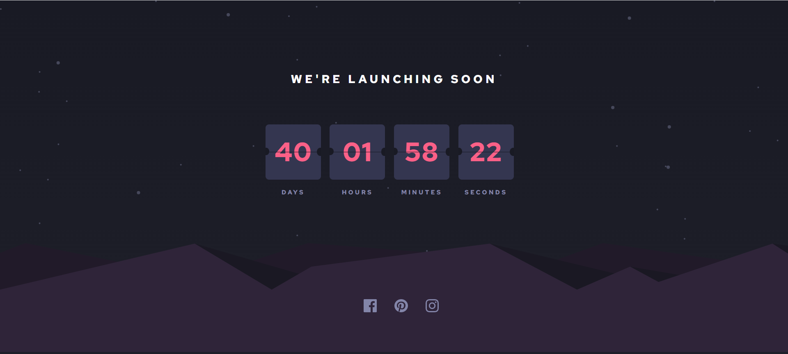
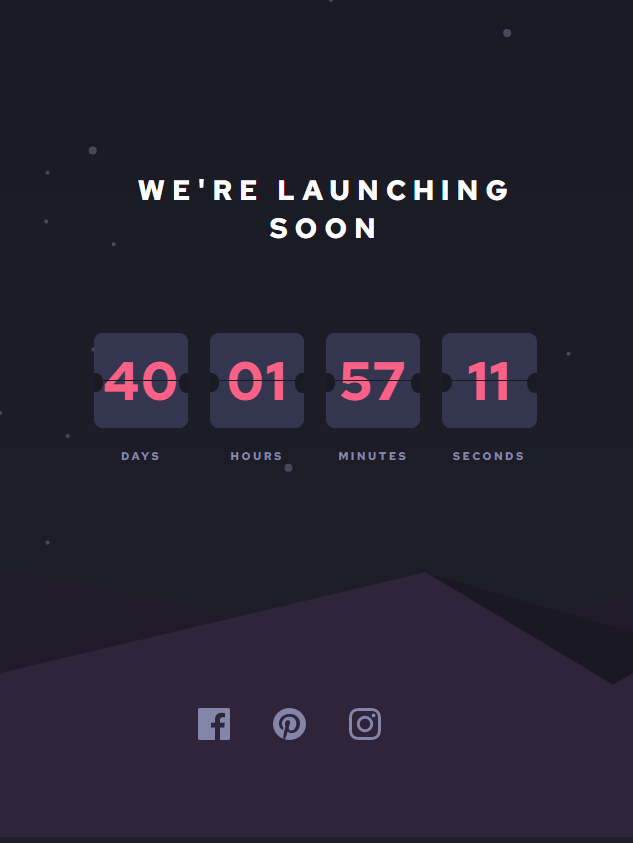

# Frontend Mentor - Launch countdown timer solution

This is a solution to the [Launch countdown timer challenge on Frontend Mentor](https://www.frontendmentor.io/challenges/launch-countdown-timer-N0XkGfyz-).

## Table of contents

- [Overview](#overview)
  - [The challenge](#the-challenge)
  - [Screenshot](#screenshot)
  - [Links](#links)
- [My process](#my-process)
  - [Built with](#built-with)
  - [Useful resources](#useful-resources)
- [Author](#author)

## Overview

### The challenge

Users should be able to:

- See hover states for all interactive elements on the page
- See a live countdown timer that ticks down every second (start the count at 14 days)

### Screenshot

### Links

- Solution URL: [GitHub](https://github.com/Vinitvh/countdown-timer-react)
- Live Site URL: [Add live site URL here](https://your-live-site-url.com)

## My process

### Built with

- Semantic HTML5 markup
- CSS custom properties
- Flexbox
- Mobile-first workflow
- [React](https://reactjs.org/) - JS library

### Useful resources

- [geeksforgeeks](https://www.geeksforgeeks.org/how-to-create-a-countdown-timer-using-reactjs/)

## Author

- Website - [Add your name here](https://www.your-site.com)
- Frontend Mentor - [@vinitvh](https://www.frontendmentor.io/profile/vinitvh)
- Twitter - [@vinitvh009](https://www.twitter.com/vinitvh009)
